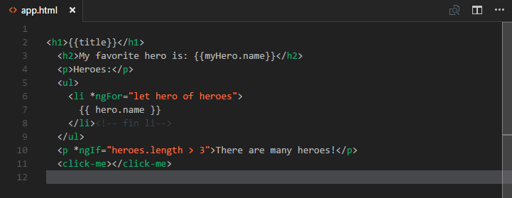
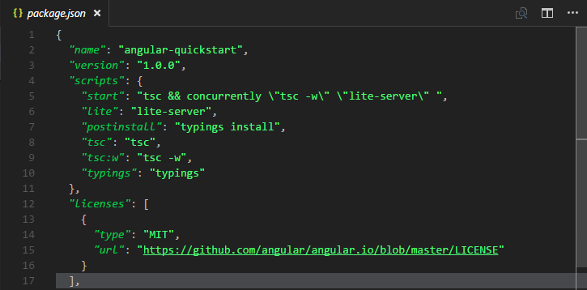
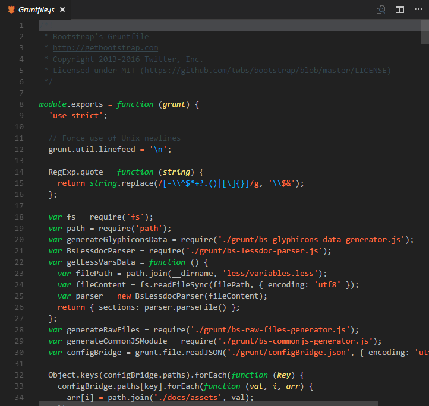
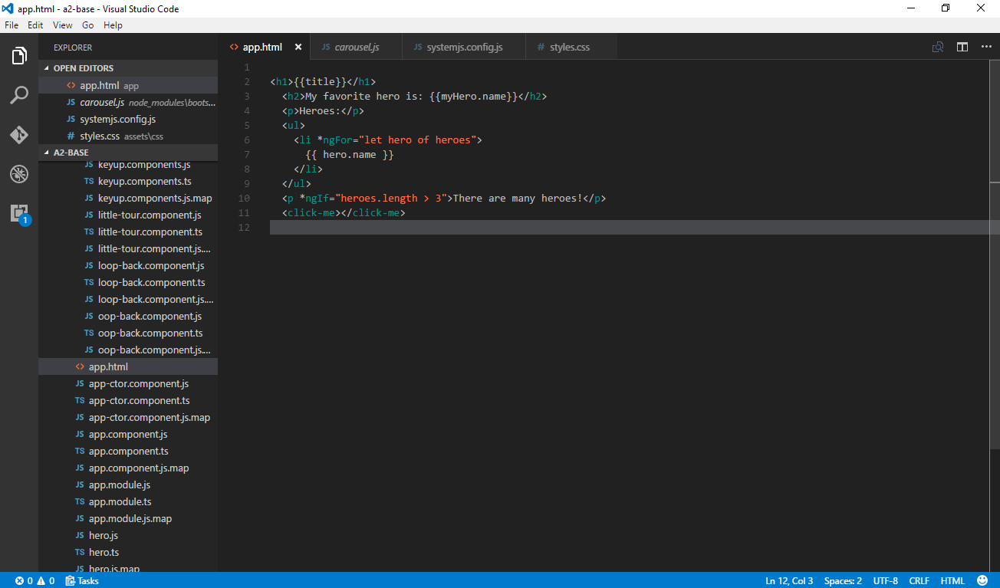

=======
# README
## This is the README for your extension "theme-color-coffee"
You can author your README using Visual Studio Code.  Here are some useful editor keyboard shortcuts:

* Split the editor (`Cmd+\` on OSX or `Ctrl+\` on Windows and Linux)
* Toggle preview (`Shift+CMD+V` on OSX or `Shift+Ctrl+V` on Windows and Linux)
* Press `Ctrl+Space` (Windows, Linux) or `Cmd+Space` (OSX) to see a list of Markdown snippets

## Manual mode
Clone a copy of the repo:

```
git clone https://github.com/FredPizarro/theme-color-coffee.git
```

in you location `.vscode/extensions` under your user directory.

Depending on your platform, this folder is located here:
* **Windows** `%USERPROFILE%\.vscode\extensions`
* **Mac** `$HOME/.vscode/extensions`
* **Linux** `$HOME/.vscode/extensions`

As this location is under your user directory, the content is persisted across VS Code updates.

### For more information
* [Visual Studio Code's Markdown Support](http://code.visualstudio.com/docs/languages/markdown)
* [Markdown Syntax Reference](https://help.github.com/articles/markdown-basics/)

=======
# Images

## view in html

## view in json

## view in javascript

## Preview



=======
# Contact
More contributions and suggestions in the theme to:

* E-mail:  Freddy_ps_3@hotmail.com
* Twitter: https://twitter.com/Fred_Pizarro


**Enjoy!**

